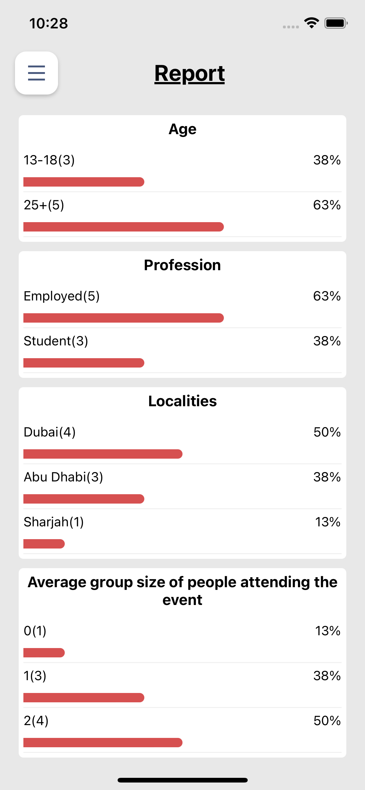

# steps for generating the app for Android:
## step1: 
npx react-native bundle --platform android --dev false --entry-file index.js --bundle-output android/app/src/main/assets/index.android.bundle --assets-dest android/app/src/main/res

## Step2: Go to android directory:
  cd android

## Step3: Now in this android folder, run this command:
  for mac/linux: ./gradlew assembleDebug
  for windows: gradlew assembleDebug or .\gradlew assembleDebug

## App Images:

